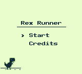
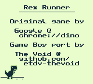
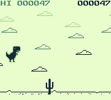
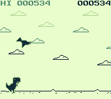
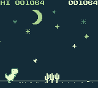

# Rex Runner GB

A WIP clone of Google Chrome's popular game built for the Game Boy

## Game Boy (Color) Engine

This project was built using my homebrew engine, available here:

- [GBC Engine](https://github.com/etdv-thevoid/gbc-engine)
- [GBC Engine Core](https://github.com/etdv-thevoid/gbc-engine-core)
- [GBC Engine Utils](https://github.com/etdv-thevoid/gbc-engine-utils)
